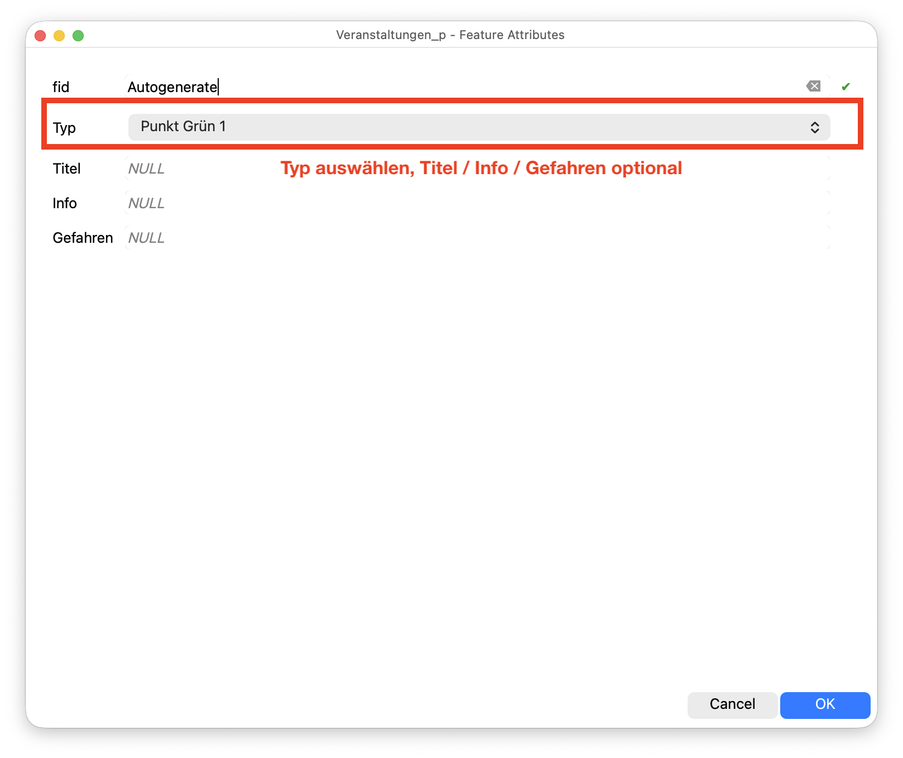
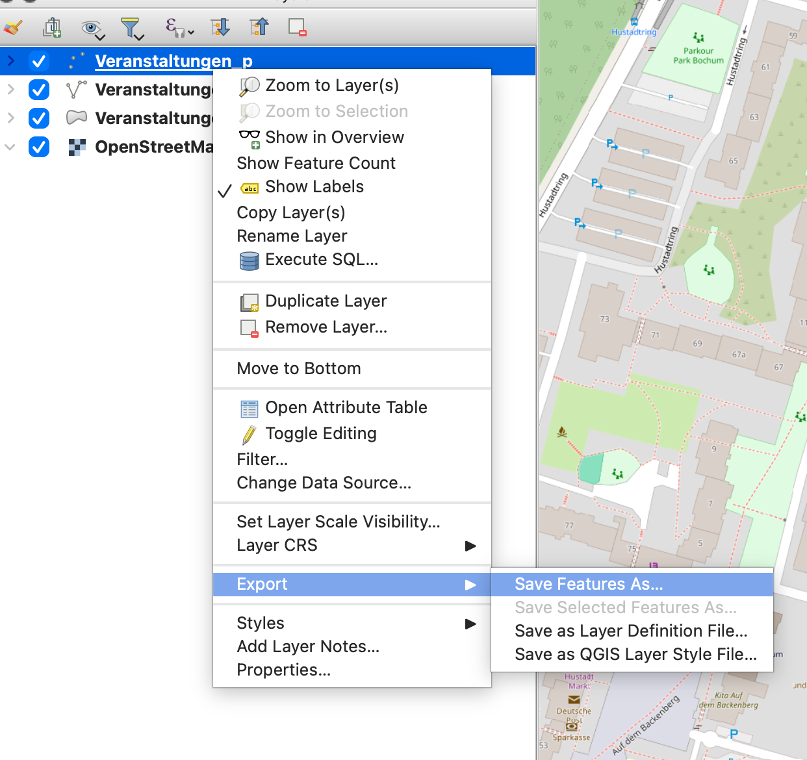
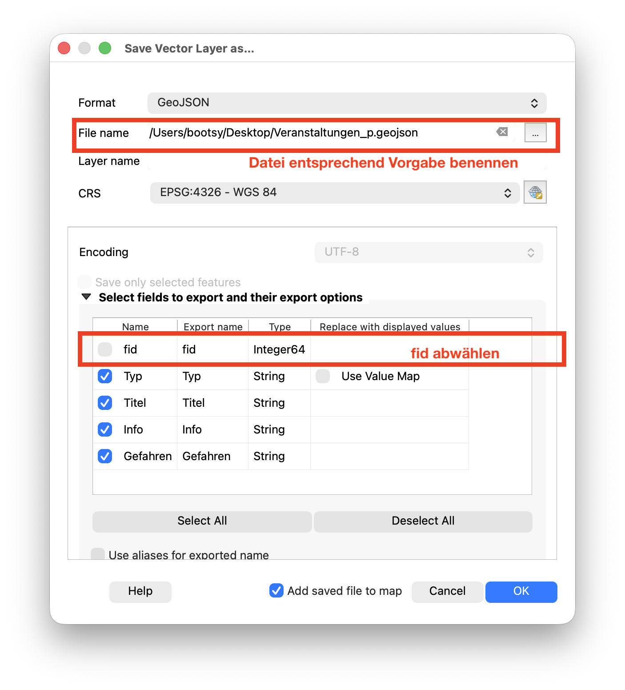

# QGIS Projektdatei

1. `Veranstaltungen.qgz` in QGIS öffnen
2. Ebenen bearbeiten und Punkte / Linien / Polygone erstellen. Typ muss immer gesetzt werden.
3. Ebenen als geojson exportieren (WGS84, ohne Attribut fid)

> [!TIP]
> **Taktische Zeichen haben momentan in QGIS kein Darstellungsicon, wird in FIRE dennoch richtig angezeigt wenn der Typ korrekt gesetzt ist.**

### Punkt / Linie / Polygon hinzufügen:
Ebene auswählen und in Bearbeiten Modus setzen.

Punktwerkzeug auf der Karte positionieren und Punkt hinzufügen, Typ setzen.

Ebene speichern.

Ebene exportieren.

Beim Export fid abwählen und den vorgegebenen Dateinamen verwenden.
