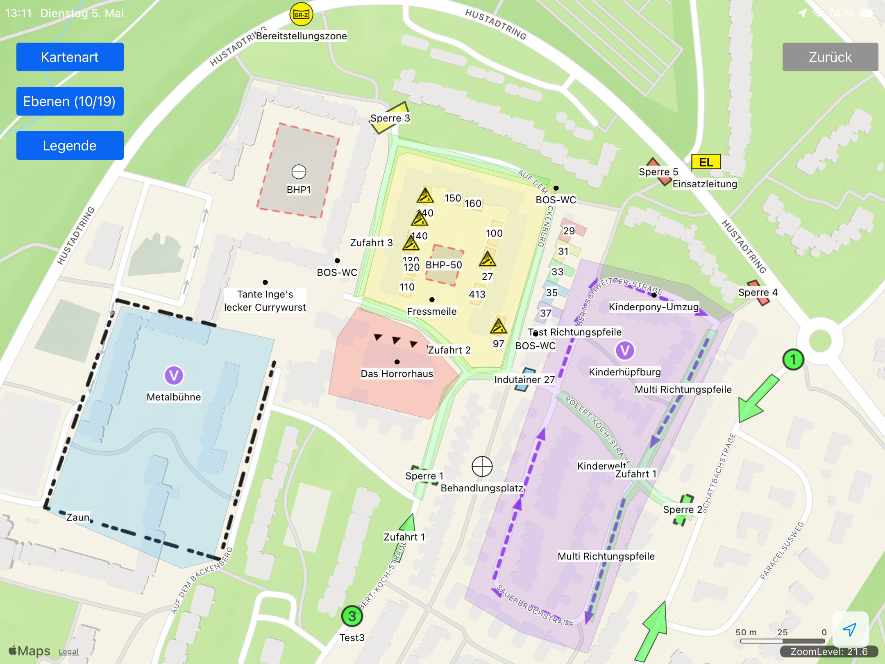
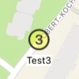
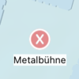

# Georeferenzierte Veranstaltungspläne



### Spezifikation
[Details](Veranstaltungspläne.md)


### Daten

Alle drei Ebenen haben dasselbe Grunddatenmodell: Typ, Titel, Info und Gefahren. Typ bestimmt die Darstellung in den anzeigenden Anwendungen. Titel ist ein optionaler ggf. auf der Karte angezeigter Text, Info und Gefahren sind Texte, die in einer Detailansicht angezeigt werden.

Typ MUSS vorhanden sein, Titel, Info und Gefahren sind optional (können weggelassen werden) oder können `null` zugewiesen bekommen.

> [!TIP]
> **Beispiel 1**
> ```json
> {
>   "type": "Feature",
>   "properties": {
>     "Typ": "Aufbauten"
>   },
>   "geometry": {...}
> }
> ```

> [!TIP]
> **Beispiel 2**
> ```json
> {
>   "type": "Feature",
>   "properties": {
>     "Typ": "Aufbauten",
>     "Titel": "Stand 27",
>     "Info": "Bratmax",
>     "Gefahren": "Gas"
>   },
>   "geometry": {...}
> }
> ```

> [!TIP]
> **Beispiel 2**
> ```json
> {
>   "type": "Feature",
>   "properties": {
>     "Typ": "Aufbauten",
>     "Titel": null,
>     "Info": null,
>     "Gefahren": null
>   },
>   "geometry": {...}
> }
> ```

### Fehlervermeidung

Es ist darauf zu achten, dass die Typen exakt wie angegeben definiert sind. Zusätzliche Leerzeichen oder abweichende Kleinschreibung führt zu fehlerhafter Darstellung.

> [!CAUTION]
> ❌ **Negativbeispiel: Leerzeichen am Ende**
> ```json
> {
>   "type": "Feature",
>   "properties": {
>     "Typ": "Punkt Gelb X "
>   },
>   "geometry": {...}
> }
> ```

> [!CAUTION]
> ❌ **Negativbeispiel: mehr als ein Leerzeichen zwischen den Textbausteinen**
> ```json
> {
>   "type": "Feature",
>   "properties": {
>     "Typ": "Punkt Gelb  X"
>   },
>   "geometry": {...}
> }
> ```

> [!CAUTION]
> ❌ **Negativbeispiel: abweichende Kleinschreibung zu Vorgabe**
> ```json
> {
>   "type": "Feature",
>   "properties": {
>     "Typ": "Punkt gelb x"
>   },
>   "geometry": {...}
> }
> ```

### Punkttypen

| Beispiel 1 | Beispiel 2 | Beispiel 3 |
|------------|-----------|-----------|
|  |  |  |


> [!TIP]
> **Beispiel 1**
> ```json
> {
>   "type": "Feature",
>   "properties": {
>     "Typ": "Punkt Blau 2",
>     "Titel": "Test2"
>   },
>   "geometry": {}
> }
> ```

> [!TIP]
> **Beispiel 2**
> ```json
> {
>   "type": "Feature",
>   "properties": {
>     "Typ": "Punkt Gelb 3",
>     "Titel": "Test3"
>   },
>   "geometry": {}
> }
> ```

> [!TIP]
> **Beispiel 3**
> ```json
> {
>   "type": "Feature",
>   "properties": {
>     "Typ": "Punkt Rot X",
>     "Titel": "Metalbühne"
>   },
>   "geometry": {}
> }
> ```


> [!TIP]
> ✅ **Good example**
> ```python
> def add(a, b):
>     return a + b
> ```

> [!WARNING]
> ❌ **Bad example**
> ```python
> def add(a, b):
>     return a+b  # missing spaces
> ```

> [!NOTE]
> ❌ **note example**
> ```python
> def add(a, b):
>     return a+b  # missing spaces
> ```

> [!IMPORTANT]
> ❌ **important example**
> ```python
> def add(a, b):
>     return a+b  # missing spaces
> ```

> [!CAUTION]
> ❌ **caution example**
> ```python
> def add(a, b):
>     return a+b  # missing spaces
> ```