# Georeferenzierte Veranstaltungspläne

Daten- und Stylemodell für die Darstellung von feuerwehrrelevanten Veranstaltungsinformationen auf Karten.

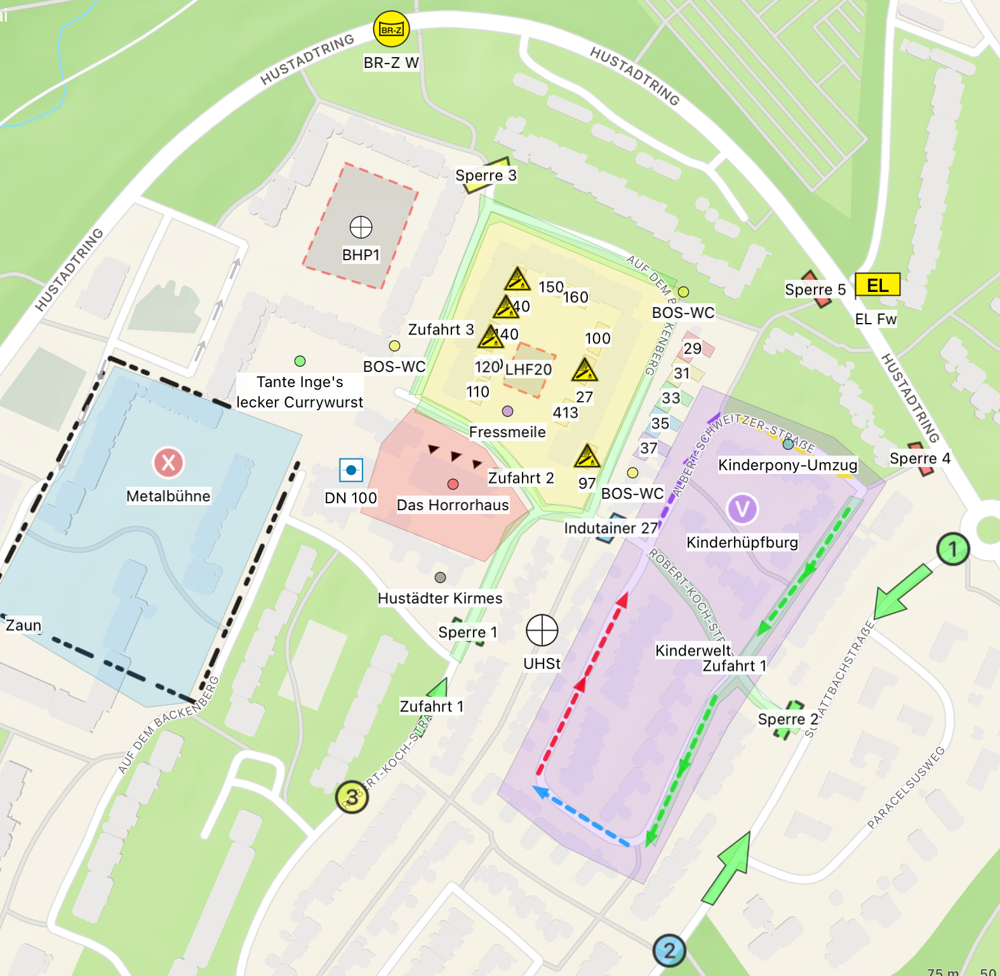

Das Datenmodell besteht aus vorgegebenen GeoJSON-Properties und einer Style-Vorlage, die applikationsspezifisch umzusetzen ist.

## Datenmodell

Je eine GeoJSON Datei als FeatureCollection mit **WGS84 als Koordinatenprojektion**:

- Punktebene: `Veranstaltungen_p.geojson`
- Linienebene: `Veranstaltungen_l.geojson`
- Polygonebene: `Veranstaltungen_f.geojson`

Die Dateien sind entsprechend zu benennen.

### GeoJSON Feature Properties:

| Property name | Property type | Beschreibung | Verpflichtend? |
| --- | --- | ----------- | ----------- |
| `Typ` | `string` | Definiert den Typ des Features, notwendig für die Darstellungskonfiguration (Style). | MUSS |
| `Titel` | `string`  | Optionaler Titel, der in der Karte unter einem Punkt, entlang einer Linie oder innerhalb eines Polygones dargestellt wird. | KANN |
| `Info` | `string` | Optionale Hinweise, die in einer Detailansicht zum Kartenelement dargestellt werden. | KANN |
| `Gefahren` | `string` | Optionale Gefahrenhinweise, die in einer Detailansicht zum Kartenelement dargestellt werden. | KANN |

#### Beispiel
> [!TIP]
> **Beispiel FeatureCollection mit einem Punktfeature**
> ```json
> {
>   "type": "FeatureCollection",
>   "features": [
>     {
>       "type": "Feature",
>       "properties": {
>         "Typ": "Punkt Rot X",
>         "Titel": "Metalbühne",
>         "Info": "Ab 22 Uhr spielt Alice Cooper.",
>         "Gefahren": null
>       },
>       "geometry": {
>         "type": "Point"
>         "coordinates": [
>           7.27044,
>           51.45743
>         ]
>       }
>     }
>   ]
> }
> ```

### Punkttypen

Im folgenden werden die Ausprägungen der einzelnen Punkttypen und deren gedachter Anwendungszweck definiert:

| Typ | Angedachte Verwendung | Vorschau | Beispiel Feature Properties |
| --- | ----------- | ----------- | ----------- |
| `Hinweis (Rot\|Gelb\|Grün\|Blau\|Lila)` | Darstellung von Texthinweisen auf der Karte, nur sinnvoll mit Titel. |  | <pre> { <br> &emsp; "Typ": "Hinweis Gelb",<br> &emsp; "Titel": "BOS-WC" <br> } </pre> |
| `Hinweis Global` | Wie Hinweis, nur ist der Text auch in kleineren Zoomstufen sichtbar. | 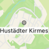 | <pre> { <br> &emsp; "Typ": "Hinweis Global",<br> &emsp; "Titel": "Hustädter Kirmes" <br> } </pre> |
| `Punkt (Rot\|Gelb\|Grün\|Blau\|Lila) ([1-50]\|[A-Z])` | Darstellung von durchnummerierten / durchbuchstabierten Punkten. Der Kontext ergibt sich aus weiteren Kartenelementen der Umgebung oder aus dem optionalen Titel. |    | <pre> { <br> &emsp; "Typ": "Punkt Blau 2" <br> } </pre> <pre> { <br> &emsp; "Typ": "Punkt Gelb 3",<br> &emsp; "Titel": "Test3" <br> } </pre> <pre> { <br> &emsp; "Typ": "Punkt Rot X",<br> &emsp; "Titel": "Metalbühne" <br> } </pre> |
| `Bereitstellungsraum` | Darstellung von vorgeplanten Orten mit taktischer Bedeutung. | 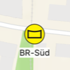 | <pre> { <br> &emsp; "Typ": "Bereitstellungsraum",<br> &emsp; "Titel": "BR Süd" <br> } </pre> |
| `Bereitstellungszone` | Darstellung von vorgeplanten Orten mit taktischer Bedeutung. |  | <pre> { <br> &emsp; "Typ": "Bereitstellungszone",<br> &emsp; "Titel": "BR-Z W" <br> } </pre> |
| `Einsatzleitung `| Darstellung von vorgeplanten Orten mit taktischer Bedeutung. |  | <pre> { <br> &emsp; "Typ": "Einsatzleitung",<br> &emsp; "Titel": "EL Fw" <br> } </pre> |
| `Befehlsstelle` | Darstellung von vorgeplanten Orten mit taktischer Bedeutung. | 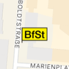 | <pre> { <br> &emsp; "Typ": "Befehlsstelle" <br> } </pre> |
| `Drohnengruppe` | Darstellung von vorgeplanten Orten mit taktischer Bedeutung. | 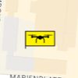 | <pre> { <br> &emsp; "Typ": "Drohnengruppe" <br> } </pre> |
| `Behandlungsplatz` | Darstellung von vorgeplanten Orten mit taktischer Bedeutung. |  | <pre> { <br> &emsp; "Typ": "Behandlungsplatz",<br> &emsp; "Titel": "UHSt" <br> } </pre> |
| `Hydrant` | Darstellung von vorgeplanten Orten mit taktischer Bedeutung. | 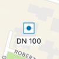 | <pre> { <br> &emsp; "Typ": "Hydrant",<br> &emsp; "Titel": "DN 100" <br> } </pre> |

Bei der Geometrie sind jeweils sowohl die Einzelobjekte als auch die jeweiligen Multiobjekte möglich (z. B. `Point`, als auch `MultiPoint`).

#### Beispiele

`Typ` MUSS vorhanden sein, `Titel`, `Info` und `Gefahren` sind optional (können weggelassen werden) oder können `null` zugewiesen bekommen.

> [!TIP]
> **Beispiel: nur Typ**
> ```json
> {
>   "type": "Feature",
>   "properties": {
>     "Typ": "Aufbauten"
>   },
>   "geometry": {...}
> }
> ```

> [!TIP]
> **Beispiel: Titel, Info und Gefahren mit Textzuweisung**
> ```json
> {
>   "type": "Feature",
>   "properties": {
>     "Typ": "Aufbauten",
>     "Titel": "Stand 27",
>     "Info": "Bratmax",
>     "Gefahren": "Gas"
>   },
>   "geometry": {...}
> }
> ```

> [!TIP]
> **Beispiel: Titel, Info und Gefahren mit null Zuweisung**
> ```json
> {
>   "type": "Feature",
>   "properties": {
>     "Typ": "Aufbauten",
>     "Titel": null,
>     "Info": null,
>     "Gefahren": null
>   },
>   "geometry": {...}
> }
> ```

#### Fehlervermeidung

Es ist darauf zu achten, dass die Typen exakt wie angegeben definiert sind. Zusätzliche Leerzeichen oder abweichende Kleinschreibung führt zu fehlerhafter Darstellung.

> [!CAUTION]
> ❌ **Negativbeispiel: Leerzeichen am Ende**
> ```json
> {
>   "type": "Feature",
>   "properties": {
>     "Typ": "Punkt Gelb X "
>   },
>   "geometry": {...}
> }
> ```

> [!CAUTION]
> ❌ **Negativbeispiel: mehr als ein Leerzeichen zwischen den Textbausteinen**
> ```json
> {
>   "type": "Feature",
>   "properties": {
>     "Typ": "Punkt Gelb  X"
>   },
>   "geometry": {...}
> }
> ```

> [!CAUTION]
> ❌ **Negativbeispiel: abweichende Kleinschreibung zu Vorgabe**
> ```json
> {
>   "type": "Feature",
>   "properties": {
>     "Typ": "Punkt gelb x"
>   },
>   "geometry": {...}
> }
> ```

> [!CAUTION]
> ❌ **Negativbeispiel: invalides JSON (ein Komma zu viel hinter "Typ" Property)**
> ```json
> {
>   "type": "Feature",
>   "properties": {
>     "Typ": "Punkt Gelb X ",
>   },
>   "geometry": {...}
> }
> ```

### Linientypen

Im folgenden werden die Ausprägungen der einzelnen Linientypen und deren gedachter Anwendungszweck definiert:

| Typ | Angedachte Verwendung | Vorschau | Beispiel Feature Properties |
| --- | ----------- | ----------- | ----------- |
| `Richtungspfeil (Rot\|Gelb\|Grün\|Blau\|Lila)` | Darstellung von Verlaufsrichtungen, z. B. eines Veranstaltungszuges. | 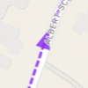 | <pre> { <br> &emsp; "Typ": "Richtungspfeil Lila" <br> } </pre> |
| `Zaunanlage` | Darstellung von Zäunen. Sollte in Kombination mit Zugang oder Zufahrt verwendet werden um Zugangsmöglichkeiten darzustellen. | 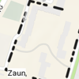 | <pre> { <br> &emsp; "Typ": "Zaunanlage",<br> &emsp; "Titel": "Zaun" <br> } </pre> |

Bei der Geometrie sind jeweils sowohl die Einzelobjekte als auch die jeweiligen Multiobjekte möglich (z. B. `LineString` als auch `MultiLineString`).

### Polygontypen

Im folgenden werden die Ausprägungen der einzelnen Polygontypen und deren gedachter Anwendungszweck definiert:

| Typ | Angedachte Verwendung | Vorschau | Beispiel Feature Properties |
| --- | ----------- | ----------- | ----------- |
| `Fläche (Rot\|Gelb\|Grün\|Blau\|Lila)` | Darstellung von Veranstaltungsflächen mit unterschiedlichen Farben. | 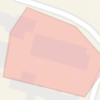 | <pre> { <br> &emsp; "Typ": "Fläche Rot" <br> } </pre> |
| `Aufbauten` | Darstellung von Veranstaltungsaufbauten, z. B. Hütten / Stände oder ähnliches. | 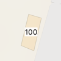 | <pre> { <br> &emsp; "Typ": "Aufbauten",<br> &emsp; "Titel": "100" <br> } </pre> |
| `Aufstellfläche` | Vordefinierte Aufstellflächen für die Feuerwehr. | 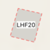 | <pre> { <br> &emsp; "Typ": "Aufstellfläche",<br> &emsp; "Titel": "LHF20" <br> } </pre> |
| `(Feste\|Mobile\|Teilmobile) Sperre` | Sperre im Rahmen des Veranstaltungsschutzes. |  | <pre> { <br> &emsp; "Typ": "Feste Sperre",<br> &emsp; "Titel": "Sperre 4" <br> } </pre> |
| `Indutainer` | Sperre im Rahmen des Veranstaltungsschutzes. | 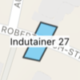 | <pre> { <br> &emsp; "Typ": "Indutainer",<br> &emsp; "Titel": "Indutainer 27" <br> } </pre> |
| `Zugang` | Zugangsmöglichkeiten zu einem Gebäude / Gelände. | 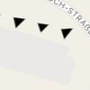 | <pre> { <br> &emsp; "Typ": "Zugang" <br> } </pre> |
| `Zufahrt` | Zufahrtsmöglichkeiten zu der Veranstaltung. |  | <pre> { <br> &emsp; "Typ": "Zufahrt" <br> } </pre> |

Bei der Geometrie sind jeweils sowohl die Einzelobjekte als auch die jeweiligen Multiobjekte möglich (z. B. `Polygon` als auch `MultiPolygon`).

### Hilfspunkttypen

Im folgenden werden die Ausprägungen der einzelnen Spezialfälle in Form von Hilfspunkttypen und deren gedachter Anwendungszweck definiert:

| Typ | Angedachte Verwendung | Vorschau | Beispiel Feature Properties |
| --- | ----------- | ----------- | ----------- |
| `Aufbauten` (Polygon) | Darstellung Gefahren bei Aufbauten. | 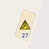 | <pre> { <br> &emsp; "Typ": "Aufbauten",<br> &emsp; "Titel": "27",<br> &emsp; "Gefahren": "Gas" <br> } </pre> |


### JSON schema

Für die drei Ebenen existiert jeweils auch ein json.schema, das zur Validierung der Geodaten genutzt werden kann:

- [Punktebene Schema](.schemas/Veranstaltungen_p.schema.json)
- [Linienebene Schema](.schemas/Veranstaltungen_p.schema.json)
- [Polygonebene Schema](.schemas/Veranstaltungen_p.schema.json)

## Stylemodell (nicht Teil der Daten)

Die Darstellung der Daten ist applikationsspezifisch umzusetzen und **nicht Teil des GeoJSON Datenmodells**. Das Stylemodell muss nicht als Teil der Daten zur Verfügung gestellt werden.

#### Punkttypen

Im folgenden werden die zu verwendenden Füllfarben und Symbole der einzelnen Punkttypen definiert, die Symbole verweisen exemplarisch auf `Apple SF Symbols` (applikationsspezifisch):

| Typ | Füllfarbe (hex) | Symbol |
| --- | ----------- | ----------- | 
| `Hinweis Global` | #33333366 | `circle.fill` |
| `Hinweis Rot` | #FF000066 | `circle.fill` |
| `Hinweis Gelb` | #FFFF0066 | `circle.fill` |
| `Hinweis Grün` | #00FF0066 | `circle.fill` |
| `Hinweis Blau` | #00aaff66 | `circle.fill` |
| `Hinweis Lila` | #eb34b166 | `circle.fill` |
| `Punkt Rot ([1-50]\|[A-Z])` | #FF000066 | `([1-50]\|[A-Z]).circle.fill` |
| `Punkt Gelb ([1-50]\|[A-Z])` | #FFFF0066 | `([1-50]\|[A-Z]).circle.fill` |
| `Punkt Grün ([1-50]\|[A-Z])` | #00FF0066 | `([1-50]\|[A-Z]).circle.fill` |
| `Punkt Blau ([1-50]\|[A-Z])` | #00aaff66 | `([1-50]\|[A-Z]).circle.fill` |
| `Punkt Lila ([1-50]\|[A-Z])` | #eb34b166 | `([1-50]\|[A-Z]).circle.fill` |

Die anderen hier nicht genannten Punkttypen sind mit den entsprechenden tatkischen Zeichen oder den Symbolen der DIN 14095 zu versehen.

#### Linientypen

Im folgenden werden die zu verwendenden Linienfarben und Dashpattern der einzelnen Linientypen definiert:

| Typ | Linienfarbe (hex) | Dashpattern | Hinweis |
| --- | ----------- | ----------- | ----------- | 
| `Richtungspfeil Rot` | #FF0000EE | `- -` | Der Richtungspfeil ist in Verlaufsrichtung am Ende der Linie applikationsspezifisch hinzuzufügen. |
| `Richtungspfeil Gelb` | #FFFF00EE | `- -` | Der Richtungspfeil ist in Verlaufsrichtung am Ende der Linie applikationsspezifisch hinzuzufügen. |
| `Richtungspfeil Grün` | #00FF00EE | `- -` | Der Richtungspfeil ist in Verlaufsrichtung am Ende der Linie applikationsspezifisch hinzuzufügen. |
| `Richtungspfeil Blau` | #00aaffEE | `- -` | Der Richtungspfeil ist in Verlaufsrichtung am Ende der Linie applikationsspezifisch hinzuzufügen. |
| `Richtungspfeil Lila` | #8F34EBEE | `- -` | Der Richtungspfeil ist in Verlaufsrichtung am Ende der Linie applikationsspezifisch hinzuzufügen. |
| `Zaunanlage` | #000000EE | `- . .` | |

#### Polygontypen

Im folgenden werden die zu verwendenden Linienfarben, Dashpattern und Füllfarben der einzelnen Polygontypen definiert:

| Typ | Linienfarbe (hex) | Dashpattern | Füllfarbe (hex) |
| --- | ----------- | ----------- | ----------- | 
| `Fläche Rot` | #000000AA | `-` | #FF000066 | 
| `Fläche Gelb` | #000000AA | `-` | #FFFF0066 | 
| `Fläche Grün` | #000000AA | `-` | #00FF0066 |
| `Fläche Blau` | #000000AA | `-` | #00aaff66 |
| `Fläche Lila` | #000000AA | `-` | #eb34b166 |
| `Aufbauten` | #000000AA | `-` | #FBB13066 |
| `Aufstellfläche` | #FF0000 | `- -` | #8080807F |
| `Feste Sperre` | #000000 | `-` | #FF0000AA |
| `Mobile Sperre `| #000000 | `- -` | #00FF00AA |
| `Teilmobile Sperre` | #000000 | `-` | #FFFF00AA |
| `Indutainer` | #000000 | `-` | #0000FFAA |
| `Zugang` | - | - | #000000 |
| `Zufahrt `| #000000 | `-` | #00FF00AA |

#### Hilfspunkttypen

Im folgenden werden die zu verwendenden Füllfarben und Symbole der definierten Spezialfälle in Form von Hilfspunkttypen definiert, die Symbole verweisen exemplarisch auf `Apple SF Symbols` (applikationsspezifisch) oder auf die DIN 14095:

| Typ | Spezialfall | Symbol |
| --- | ----------- | ----------- | 
| `Aufbauten` (Polygon) | `Gefahren CONTAINS 'Gas'` | DIN 14095 `P617` |

